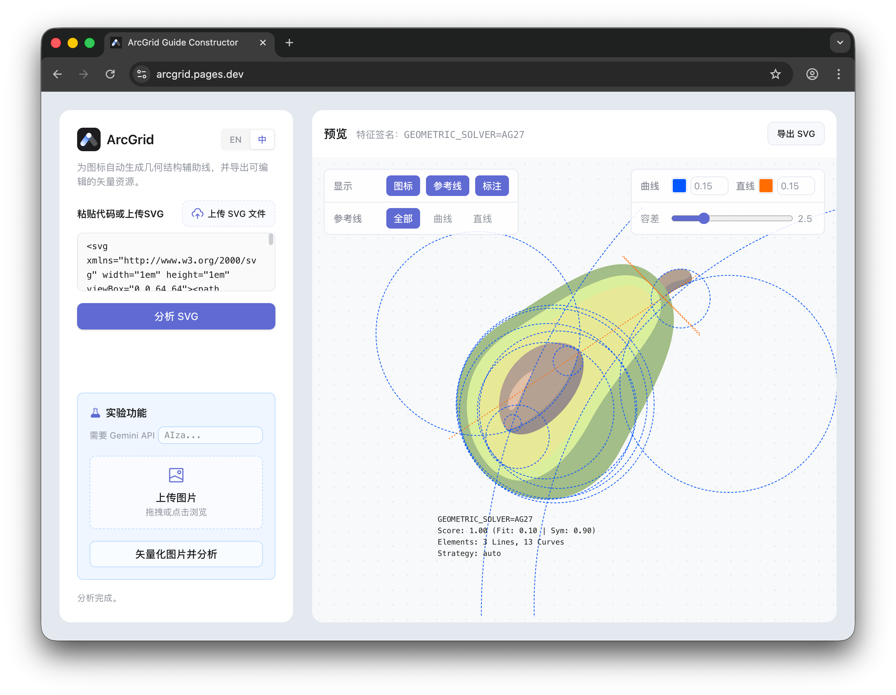

# ArcGrid Guide Lab 📐

[中文](#-中文) | [English](#-english)

---



## 🇨🇳 中文

**ArcGrid** 是一款用于生成**图标比例绘图和辅助线**的设计工具，可自动为设计作品提取并标注专业的几何制图规范，现已同时提供 Web 版与 Figma 插件。

**✨ 在线体验:** [https://charlex.me/lab/arcgrid/](https://charlex.me/lab/arcgrid/)

**🔌 Figma 插件:** [ArcGrid - Figma Community](https://www.figma.com/community/plugin/1611785992561051368/arcgrid)

> 可直接在 Figma 中选中单个 SVG 元素进行分析，并将生成的辅助线与标注重新导出回画布。

### ✨ 功能特性

- 🔄 **双轨输入系统** - 支持直接粘贴/上传 SVG，或通过 Gemini AI 将图像 (PNG/JPG) 一键智能矢量化
- 🧠 **智能几何分析** - 自动识别图形特征，生成精确的圆、圆弧和对齐线计算方案
- 🛠️ **强悍的 SVG 解析** - 自动转换描边为填充、过滤冗余元素并完美应对复杂的变换矩阵
- 🎨 **精细化交互体验** - 实时动态调整检测容差，支持图层切换以及辅线颜色、粗细的自定义
- ✨ **动感可视化** - 渲染过程自带优美的辅助线生长动画
- 📥 **高质量规格导出** - 一键将生成的制图规范及网格导出为 SVG 或 PDF 格式

### 🚀 快速上手

```bash
# 克隆仓库并安装依赖
git clone <repository-url>
cd ArcGrid
npm install

# 启动开发服务器 (自动运行 Tailwind & Wrangler)
npm run dev
```

> 访问 `http://localhost:8788` 即可开始使用。

### ⚙️ API 配置

完全**免环境配置**。直接在网页设置面板输入 **Gemini API Key** 即可启用 AI 视觉功能：

- 原生支持 **gemini-3.1-flash-image-preview** 及 **gemini-2.5-flash-image**
- 密钥安全存储于浏览器本地 (Local Storage)
- *(注：仅在使用“图像转 SVG”实验性功能时需要配置)*

### 🔧 技术栈

- **前端** - 原生 HTML5 / Tailwind CSS / ES Modules
- **后端** - Cloudflare Pages Functions (Hono.js)
- **大语言模型** - Google Gemini API

---

## 🇺🇸 English

**ArcGrid** is a design tool for generating **professional construction lines and geometric annotations** for logo designs, now available as both a web app and a Figma plugin.

**✨ Live Demo:** [https://charlex.me/lab/arcgrid/](https://charlex.me/lab/arcgrid/)

**🔌 Figma Plugin:** [ArcGrid - Figma Community](https://www.figma.com/community/plugin/1611785992561051368/arcgrid)

> In Figma, you can select a single SVG element, analyze it directly, and export the generated guides and annotations back onto the canvas.

### ✨ Key Features

- 🔄 **Double-Track Input** - Directly paste/upload SVGs, or use Gemini AI to automatically vectorize raster images (PNG/JPG).
- 🧠 **Intelligent Analysis** - Automatically detects circles, arcs, and alignment lines to create precise construction candidates.
- 🛠️ **Robust SVG Processing** - Handles stroke-to-fill conversions, ignores non-renderable `<defs>`, and tackles complex transformations.
- 🎨 **Interactive UI** - Real-time tolerance adjustment, visibility toggles for layers, and customizable guide colors/weights.
- ✨ **Stunning Visuals** - Features an engaging animated line-drawing effect during validation and rendering.
- 📥 **Professional Export** - Export your customized construction guides as high-quality SVGs or PDFs natively.

### 🚀 Getting Started

```bash
# Clone the repo and install dependencies
git clone <repository-url>
cd ArcGrid
npm install

# Start the development server
npm run dev
```

> The application will be running at `http://localhost:8788`.

### ⚙️ API Configuration

No `.env` required. Input your **Gemini API Key** directly in the web settings panel:

- Native support for **gemini-3.1-flash-image-preview** and **gemini-2.5-flash-image**.
- Keys are securely stored in your browser's local storage.
- *(Note: Gemini API is only required for the experimental Image-to-SVG vectorization feature).*

### 🔧 Tech Stack

- **Frontend** - Vanilla HTML5 / Tailwind CSS / ES Modules
- **Backend / Hosting** - Cloudflare Pages Functions (Hono.js)
- **AI Integration** - Google Gemini API

---

## 📄 许可证 / License

[MIT](LICENSE)
